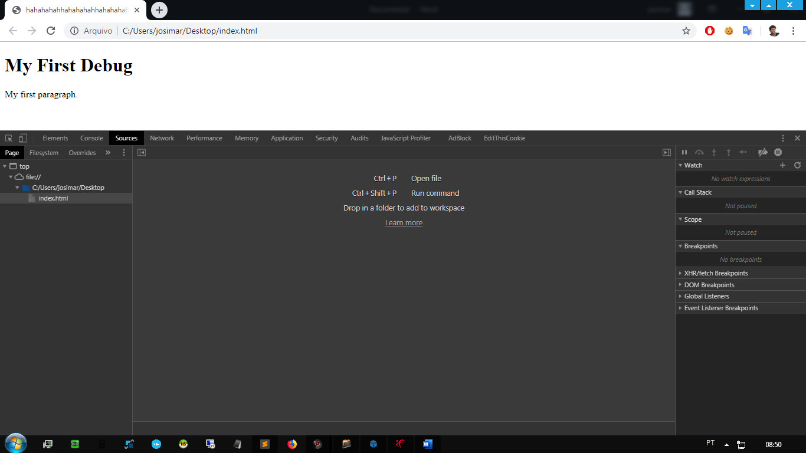
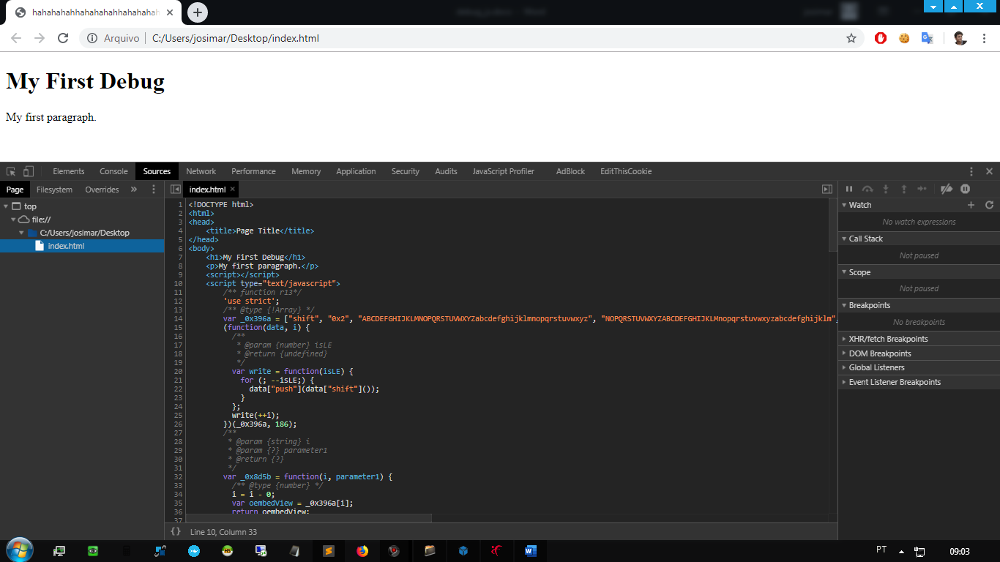
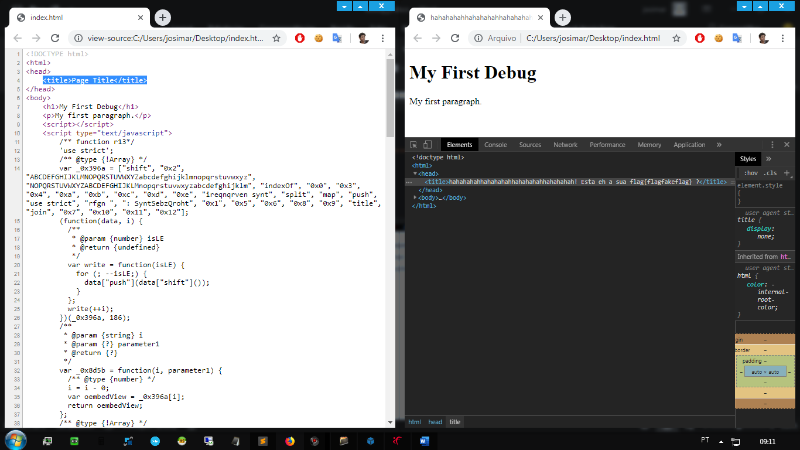
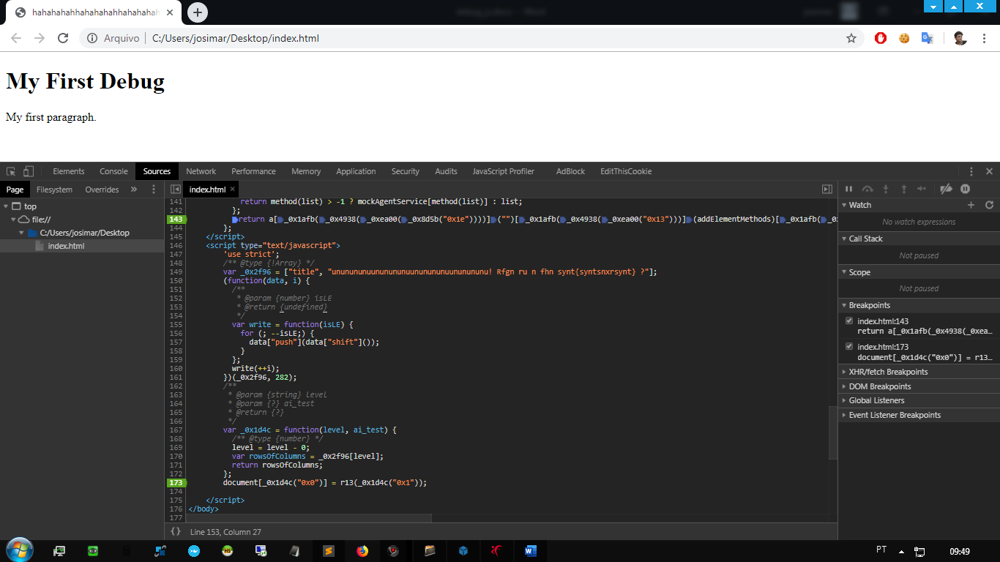
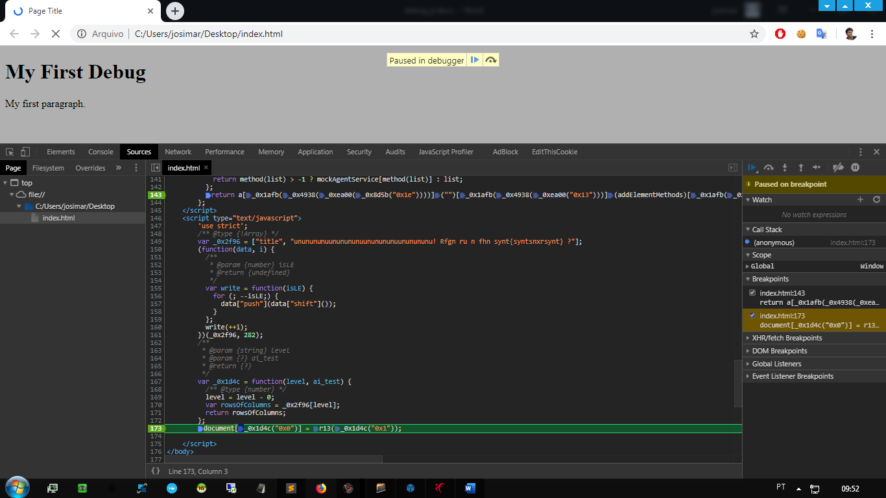
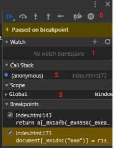
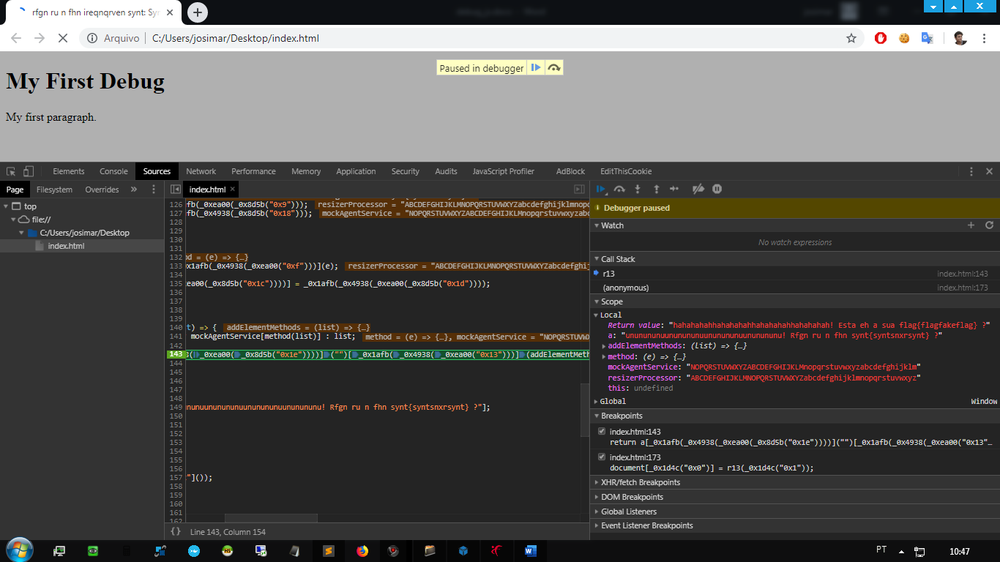

Olá pessoal!

  
Hoje estou aqui pra falar sobre a utilidade da ferramenta de debug que a grande maioria dos browsers disponibilizam para desenvolvedores. Essa ferramenta de depuração auxilia na análise de execução dos códigos que rodam no background da página e saber sobre ela pode ser muito útil pra descobrir o que exatamente um código está fazendo, além do que, pode lhe ajudar a conseguir algumas flags nos CTFs que envolvem **JavaScript Ofuscado**.

Estarei usando o Google Chrome como browser para mostrar o básico do debugger, pois o conteúdo em seu total é muito extenso, mas caso se interesse no assunto, a Google disponibiliza de fácil acesso seus manuais.

Então...vamos lá!

Para ter acesso ao debugger:

*   Ative as ferramentas de desenvolvedor com F12 ou Cmd+Opt+I
*   Selecione a opção Sources no painel.

Feito isso você chegara nesse ponto da imagem acima e claramente é possível perceber que a janela é dividida e 3 partes.

1.  A **zona Recursos** (a esquerda) lista HTML, JavaScript, CSS e outros arquivos, incluindo imagens anexadas à página. As extensões do Chrome também podem aparecer aqui.
2.  A **zona de origem** (no centro) mostra o código-fonte.
3.  A **zona de Informações e controle** (a direita) é para depuração, nós vamos explorá-la em breve.

Se olharmos primeiramente para a **Zona de Recursos** nota-se um **index.html**, e é o conteúdo desse arquivo que irei usar para exemplificar algumas funções da **zona de Informações e controle**.

Após selecionar o **index.html** o conteúdo do mesmo é carregado na **zona de origem** e já podemos ver o seu código fonte, e é fácil perceber que há um código javascript e que o mesmo possui duas funções separadas, cada um dentro de suas tags **<script>**, porem ao carregar a página não é possível perceber nenhuma execução de código.

Mas será mesmo que nada está executando?

Para sabermos isso vamos olhar o código fonte estático (Ctrl+u) e compara-lo ao código dinâmico da guia **Elements**.

  

Na imagem acima é possível perceber a diferença entre o código fonte estático e o dinâmico na guia **Elements**, apenas olhando para a tag html **_<title>_**, ou seja...o javascript contido na **index.html** está alterando rapidamente o título da página dinamicamente.

Para vermos como isso acontece, vamos utilizar os **breakpoints,** que é um recurso da **zona de origem** e que após inserido o **breakpoint** ele irá aparecer também na **zona de Informações e controle**. E para inserirmos isso, basta ir na **zona de origem** e clicar no numero da linha desejada e pronto, **breakpoint** inserido. E você pode inserir quantos **breakpoints** achar necessário.

Eu estarei inserindo dois, sendo um em cada termino de função.

É fácil notar agora na imagem acima que a linha marcada na **zona de origem** ganha um realce de cor e que a agora na **zona de Informações e controle** aparece o **breakpoint** listado.

Recarregando a página F5 agora o código irá para no primeiro breakpoint que encontrar, seguindo o fluxo de execução do código. Que nesse caso é o **breakpoint** da segunda função.

Agora nessa parte vamos precisar saber um pouco mais sobre a **zona de Informações e controle,** pois nela tem recursos para navegamos e seguirmos o fluxo de execução do código.

A **zona de Informações e controle** é dividida em várias partes, mas irei abordar apenas algumas delas, pois estas serão as necessárias para demonstração básica do uso do debugger.

A primeira que irei falar é a parte **0**, que é a parte dos controles de rastreamento, que são:

*    **Continua a execução** até o próximo **breakpoint** caso houver, tecla de atalho **F8**
*    Dá um passo **(execute o próximo comando),** mas não entra na função, tecla de atalho **F10**
*    Dá um passo, porem **entra dentro da função,** tecla de atalho **F11**
*    **Continuar a execução até o final da função atual,** tecla de atalho **Shift+F1**

A execução seria interrompida na última linha da função atual. Isso é útil quando acidentalmente inserimos uma chamada aninhada usando  , mas isso não nos interessa, e queremos continuar até o fim o mais rápido possível.

*    Segue **passo a passo** a execução do código, tecla de atalho **F9**
*    **Ativar / Desativar** todos os **breakpoints**, tecla de atalho **Ctrl+F8**
*    Ativar / Desativar  a **pausa automática** em caso de erro**.**

Quando ativado e as ferramentas do desenvolvedor estão abertas, um erro de script pausa automaticamente a execução. Então podemos analisar variáveis ​​para ver o que deu errado. Então, se nosso script morre com um erro, podemos abrir o depurador, ativar essa opção e recarregar a página para ver onde ela morre e qual é o contexto naquele momento.

Agora vou falar das partes de **1** a **3 :**

1.  **Watch - mostra valores atuais para qualquer expressão.**

Você pode clicar no sinal de mais + e inserir uma expressão. O depurador mostrará seu valor a qualquer momento, automaticamente recalculando-o no processo de execução.

1.  **Call Stack - mostra a cadeia de chamadas aninhadas.**

No momento atual, o depurador está dentro da segunda função da index.html (sem função, portanto, é chamado de "anônimo").

Se você clicar em um item de pilha (por exemplo, “anônimo”), o depurador vai para o código correspondente, e todas as suas variáveis ​​também podem ser examinadas.

1.  **Scope - variáveis ​​atuais.**

Local mostra variáveis ​​de função locais. Você também pode ver seus valores destacados diretamente sobre a origem.

Global tem variáveis ​​globais (fora de qualquer função).

Agora que já sabemos os comandos básicos para controlar o fluxo de execução, vamos dar seguimento.

Dando seguimento **passo a passo** é possível perceber na imagem acima que, em determinado ponto da **segunda função** (que está ofuscada)**,** é passado um valor **title,**

e seguidamente uma **string** para a **primeira função** chamada de **r13** que nada mais é que a função **rot13** (**Rot**aciona 13 posições pra cada caractere passado),  e é nessa função que feita a decodificação da **string** que se será o novo título da página.

  

E assim, com muita paciência e calma é possível analisar, entender e ver toda a execução do código sendo realizada na página, percebendo-se que são executadas **duas funções**, sendo que a **segunda função** chama a **primeira** para decodificar a **string** que será inserida no **title** por ela.

Não pretendo fazer aqui uma análise mais detalhada, pois a minha ideia com esse **post** é apenas lhe apresentar essa poderosa ferramenta presente na maioria dos navegadores atuais e dessa forma lhe incentivar a buscar aprender mais sobre o assunto. Porém não terminamos ainda, pois esse código oferece mais um segredinho que deixarei pra você desvendar.

Que a sua curiosidade seja seu guia, **ok**?

Desde de já agradeço pela atenção de quem ficou até o final desse conteúdo.

**“E que a força esteja com você!”**
